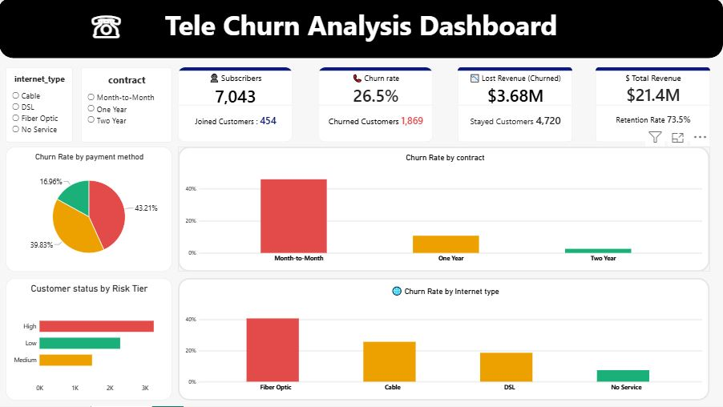

# Customer Churn Analysis

Telecom customer churn analysis using SQL, Python, and Power BI to uncover the drivers of customer attrition and support retention strategy.

---

## Project at a Glance

| Area | Details |
|---|---|
| Industry | Telecom |
| Objective | Identify churn drivers and reduce customer attrition |
| Methods | SQL, Python, Jupyter, Power BI |
| Dataset Size | 7,043 customers |
| Churn Rate | 26.5% |
| Key Business Impact | $3.68M in lost revenue |
| Final Deliverable | Interactive business dashboard and analytical summary |

---

## Executive Summary

This project analyzes telecom customer churn to determine which customer segments are most likely to leave and why. The objective is to turn raw customer behavior data into actionable business insight that supports retention strategy, service improvement, and revenue protection.

The project combines:
- SQL-based exploratory analysis
- Python data cleaning and analysis
- business-oriented churn interpretation
- a Power BI dashboard for stakeholder communication

The results show that churn is a meaningful business issue, with 1,869 customers churned out of 7,043 total, and $3.68M in lost revenue associated with churn exposure.

---

## Why This Project Matters

Customer churn is a major risk in telecom because it reduces recurring revenue and increases customer acquisition costs. Churn analysis helps businesses identify at-risk customers before they leave, optimize retention campaigns, and improve long-term customer value.

This project is valuable because it demonstrates the ability to:
- identify real business problems
- clean and analyze customer data
- find patterns in retention risk
- convert analysis into clear recommendations

---

## Business Problem

Telecom companies need to understand why customers stop using services and which segments are most at risk. This project addresses key business questions such as:

- Which contract types have the highest churn?
- Do payment methods influence churn behavior?
- Are certain internet-service types linked to higher churn risk?
- Which cities or ZIP codes require stronger retention attention?
- How much revenue is impacted by churn?

---

## Project Objective

The goal of this project is to:
1. Measure churn by customer segment.
2. Identify the strongest churn drivers.
3. Highlight revenue-risk patterns.
4. Support retention planning with data-backed recommendations.
5. Present findings in a clear, business-friendly dashboard.

---

## Key Metrics

From the project dataset and dashboard:

- Total customers: 7,043
- Churned customers: 1,869
- Retained customers: 4,720
- Overall churn rate: 26.5%
- Total revenue: $21.4M
- Lost revenue: $3.68M

These figures indicate that churn is a measurable financial risk, not just a customer service issue.

---

## Dashboard Preview



The dashboard visualizes the main findings and makes the analysis easy to understand for decision-makers, recruiters, and non-technical stakeholders.

---

## Key Findings

### 1. Contract type is a major churn driver
Customers on month-to-month contracts show significantly higher churn than those on longer contracts. This suggests that long-term plans improve retention and stability.

### 2. Payment method influences retention
Different payment types show different churn patterns. Some methods may reflect payment friction, customer behavior, or service satisfaction differences.

### 3. Internet type affects churn risk
Churn varies by internet category, indicating that service mix and customer experience may influence retention outcomes.

### 4. Churn creates measurable revenue loss
With $3.68M in lost revenue, churn has a clear financial impact and supports the need for early retention strategies.

### 5. Geography matters
City and ZIP-code analysis reveal that churn is not evenly distributed across regions, making location-based retention efforts more effective.

### 6. Customer tenure is important
Customers with longer tenure and stronger service adoption appear more stable than newer or less committed customers.

---

## Business Insights

This project answers the most important operational question:

Which customer groups are most likely to leave, and what should the business do about it?

The strongest signals in the analysis include:
- contract structure
- payment behavior
- service type
- customer tenure
- geography
- revenue and charge patterns

These findings can inform churn prevention campaigns, customer outreach, pricing review, and retention prioritization.

---

## Tools and Technologies

| Tool | Purpose |
|---|---|
| SQL | Data exploration and churn calculations |
| Python | Data cleaning, analysis, and visualization |
| Jupyter Notebook | Interactive exploratory analysis |
| PostgreSQL | Data storage and query validation |
| Power BI | Dashboard design and business reporting |

---

## Methodology

### Data Preparation
- Reviewed the telecom and ZIP-code datasets
- Identified null and missing-value issues
- Cleaned service-related columns and data quality issues
- Prepared the dataset for churn analysis

### SQL Analysis
The SQL script includes queries for:
- churn rate by contract type
- monthly charge versus churn status
- revenue comparison by customer status
- payment-method churn patterns
- service-related retention signals
- city and ZIP-code churn analysis

### Python EDA
The notebook includes:
- descriptive statistics
- data distribution checks
- churn visualizations
- correlation analysis
- customer behavior exploration

### Power BI Dashboard
The Power BI dashboard summarizes the core story with KPI cards, segment comparisons, and churn-risk indicators for business audiences.

---

## Recommendations

Based on the findings, the recommended actions are:

1. Promote longer-term contracts to reduce churn risk.
2. Focus retention campaigns on month-to-month customers.
3. Review payment methods associated with higher churn.
4. Encourage bundling and multi-service adoption.
5. Prioritize high-risk cities and ZIP codes for targeted outreach.
6. Use billing and tenure patterns to identify at-risk customers earlier.
7. Align pricing and support strategies with the most vulnerable segments.

---

## Project Impact

This project demonstrates practical analytical value by combining:
- business problem framing
- data preparation
- SQL-based analysis
- Python-driven EDA
- dashboard storytelling
- actionable business recommendations

It is well suited for roles in data analysis, BI, customer analytics, business intelligence, and retention analysis.

---

## Portfolio Value

This project shows that I can:
- work with real business data
- analyze patterns across customer segments
- use SQL and Python for analysis
- build a business-facing dashboard
- translate data into clear recommendations

That combination is valuable for recruiters looking for practical analytical capability rather than just theoretical knowledge.

---

## File Structure

```text
Customer Churn/
├── data/
│   ├── telecom_customer_churn.csv
│   └── telecom_zipcode_population.csv
├── dashboard/
│   └── churn_visual.pbix
├── image/
│   ├── dashboard_churn.JPG
│   └── image_in_pdf.pptx
├── scripts/
│   ├── churn_script.sql
│   └── customer_churn_analysis.ipynb
├── LICENSE
├── README.md
└── .git/
```

---

## How to Run the Project

### Prerequisites
- Python 3.x
- Jupyter Notebook
- SQL/PostgreSQL environment
- Power BI Desktop
- pandas, numpy, seaborn, matplotlib, SQLAlchemy

### Steps
1. Open the CSV files in the data folder.
2. Run the SQL queries from the SQL script.
3. Open the notebook to perform exploratory analysis.
4. Load the processed dataset into PostgreSQL if needed.
5. Open the Power BI dashboard to review the final business summary.

---

## Recommended Next Improvements

To make this project even stronger for job applications, I would add:
- more exact churn percentages by customer segment
- a business KPI table for management audiences
- a predictive churn model using machine learning
- a short executive slide or summary report
- a final reflection on business impact and next steps

These additions would increase the project’s depth and make it even more impressive in a professional portfolio.

---

## Author

Lalit Kumar  
LinkedIn: https://www.linkedin.com/in/lalit-kumar-d05-ds/

---

## License

This project is licensed under the MIT License.
